<div align="center">

# अधिKaar

### An Offline-First, Verified, Multilingual AI Legal Assistant for Every Indian Citizen

**Your Rights, Your Language**

Built with **Gemma** · Runs **100% on-device** · **11 Indian languages** · Nothing leaves your computer

</div>

---

## About the Project

**अधिKaar** ("Adhikaar" - meaning *"rights"*) helps ordinary Indian citizens understand their legal rights, decode legal documents, and take concrete next steps - in 11 Indian languages, by voice or text, and **entirely on their own device**.

Unlike cloud chatbots, every component runs locally: the language model, the legal knowledge base, speech recognition, speech synthesis, and document OCR. A user's questions, documents, and transcripts **never leave their machine** - you can disable Wi-Fi and it still works.

Answers are powered by Google's **Gemma** running locally through Ollama, **grounded** on 6,845 reviewed chunks of official Indian law (RAG), and **verified** claim-by-claim against real statute text so citations are backed by law rather than model memory.

>  अधिKaar provides **legal information, not legal advice**. For complex matters, consult a qualified lawyer or call NALSA on **15100**.

---

## Why It Matters

- A billion+ Indians face everyday legal problems - unpaid wages, stuck deposits, FIRs, domestic violence, consumer disputes - but lawyers are unaffordable and official information is English-first and dense.
- India's criminal laws were overhauled on **1 July 2024** (IPC → **BNS**, CrPC → **BNSS**), so even existing guidance is outdated.
- Legal matters are deeply personal → cloud AI raises real privacy fears. अधिKaar is **private by design**.

---

## Features

| Feature | What it does |
|---|---|
| **Talk to Legal Helper** | Conversational, RAG-grounded legal guidance with dynamic response depth, power-imbalance detection, and multilingual voice in/out. |
| **Law & Next Steps** | One **verified** analysis in six panels: situation & applicable law, per-claim verification, official sources with links, both-sides stress test, a shareable rights card, and a plain "explain to someone you trust" summary. |
| **Section Converter** | Instant **IPC↔BNS** and **CrPC↔BNSS** conversion (216 + 80 curated mappings) with subsection-insensitive matching and offence-name search. |
| **Translate Legal Document** | Upload a photo/PDF of a notice or FIR → on-device OCR extracts the text → the model explains it in plain words → ask questions answered **strictly from that document**. |
| **Draft a Document** | 45+ ready-to-file citizen documents (FIR requests, RTI appeals, legal notices, rent agreements, wills, POAs, complaints) generated in your language. |
| **Find Legal Aid** | PAN-India directory: State Legal Services Authorities for all 28 states + 8 UTs, Delhi district DLSAs, and national helplines (NALSA 15100, Tele-Law 14454, Women 181, Cyber 1930…). |
| **Evidence Checklists** | 20 situation-specific checklists of documents, steps, and statutory deadlines, matched to your case. |
| **Rights Card / Elder Mode / Consequence Simulator / Devil's Advocate** | Shareable sourced rights card, an intermediary-friendly explanation, a "what if you do nothing" view, and an adversarial stress test. |
| **Voice** | On-device speech-to-text (faster-whisper) and text-to-speech (MMS-TTS) in all 11 languages, with word-by-word **karaoke** read-aloud. |

---

## Tech Stack

| Layer | Technology |
|---|---|
| **Frontend** | Vanilla HTML/CSS/JavaScript SPA - **zero build step**. Vendored offline assets (Lucide, Marked, pdf.js, Tesseract.js, Noto fonts). |
| **Backend** | Python 3 · Flask · Flask-CORS - loopback-only (127.0.0.1). |
| **LLM runtime** | **Ollama** serving **Gemma** locally (`gemma4:e4b` primary, `gemma3:4b` fallback). |
| **RAG / Vector store** | **ChromaDB** (persistent) with sentence-transformers embeddings (all-MiniLM-L6-v2); **EmbeddingGemma** available. |
| **Speech-to-text** | **faster-whisper** (small, int8, CPU) with VAD + hallucination guards. |
| **Text-to-speech** | **Facebook MMS-TTS** (per-language VITS via `transformers`), browser Web Speech API fallback. |
| **Document OCR** | **PaddleOCR** (PP-OCRv6 / PP-OCRv5, Devanagari + Latin) server-side; pdf.js + Tesseract.js in-browser fallback. |
| **PDF handling** | `pypdf` (text layer) · `pypdfium2` (rasterisation, no poppler). |

---

## Architecture

The whole product runs as one local process plus a browser. The only arrow leaving your
machine is a one-time setup fetch; no question, document, transcript or voice clip ever does.

```mermaid
%%{init: {'theme':'base','themeVariables':{'background':'#FFFFFF','primaryColor':'#EEF2FF','primaryTextColor':'#1C1917','primaryBorderColor':'#4338CA','secondaryColor':'#FAF9F6','tertiaryColor':'#FFFFFF','lineColor':'#57534E','textColor':'#1C1917','mainBkg':'#FFFFFF','nodeBorder':'#4338CA','clusterBkg':'#FFFFFF','clusterBorder':'#4338CA','edgeLabelBackground':'#FFFFFF','actorBkg':'#EEF2FF','actorTextColor':'#1C1917','actorBorder':'#4338CA','signalColor':'#1C1917','signalTextColor':'#1C1917','noteBkgColor':'#FEF3C7','noteTextColor':'#1C1917','noteBorderColor':'#F59E0B','labelBoxBkgColor':'#EEF2FF','labelTextColor':'#1C1917','sequenceNumberColor':'#FFFFFF'}}}%%
flowchart TB
    U(("Citizen<br/>types or speaks<br/>in 11 languages"))

    subgraph BROWSER["BROWSER - vanilla JS SPA, zero build step"]
        direction TB
        VIEWS["Views: Home · Talk to Legal Helper · Law and Next Steps<br/>My Cases · Section Converter · Find Legal Aid<br/>Translate Document · Draft a Document · Voice Mode"]
        JS["app.js - navigateTo, i18n 11 langs, karaoke read-aloud,<br/>MediaRecorder mic capture, inline doc Q and A"]
        VEND["vendor/ pinned local copies:<br/>pdf.js, Tesseract.js, marked, lucide + Noto fonts"]
        LS[("localStorage<br/>cases, transcripts,<br/>drafts, deadlines")]
        VIEWS --- JS
        JS --- VEND
        JS --- LS
    end

    subgraph HOST["YOUR COMPUTER - the entire product lives here. No cloud. No account. Works with Wi-Fi off."]
        direction TB

        subgraph API["Flask service - 127.0.0.1:5000 - 19 REST endpoints"]
            direction LR
            E1["/api/chat"]
            E2["/api/law-and-steps"]
            E3["/api/extract-document<br/>/api/upload-document<br/>/api/ask-document<br/>/api/translate-document"]
            E4["/api/bns-convert<br/>/api/crpc-convert"]
            E5["/api/draft-document<br/>/api/document-templates"]
            E6["/api/legal-aid<br/>/api/evidence-checklists"]
            E7["/api/rights-card<br/>/api/consequence-simulator<br/>/api/panchayat-bridge<br/>/api/devil-advocate"]
            E8["/api/transcribe<br/>/api/tts"]
        end

        SESS[("sessions - in memory<br/>history + attached doc<br/>rehydrated from client<br/>after a restart")]
        UPL[("data/uploads/<br/>session doc text")]

        subgraph LOGIC["Deterministic grounding and safety logic - no model involved"]
            direction TB
            EXP["preprocess_query_for_rag<br/>multilingual expansion, KEYWORD_MAPPINGS<br/>'mera malik ne salary nahi di' -> unpaid wages"]
            PI["detect_power_imbalance<br/>injects protective advisories"]
            MC["match_checklist<br/>ranks expanded, tie-breaks on raw,<br/>returns none when ambiguous"]
            NORM["_norm_section / _match_entries<br/>318 matches 318(4), offence-name search"]
            SAN["_sanitize_sources<br/>a URL survives only if it was retrieved"]
        end

        subgraph PIPE["lawsteps_pipeline.py - the verified answer, 2 LLM calls"]
            direction TB
            DR["DRAFT - LLM call 1, temp 0.2, format=json<br/>six panels + claims, each citing chunk ids"]
            GD{"GUARD - FREE, runs before any model is trusted<br/>uncited_section_references()<br/>does a claim name a section absent<br/>from its own cited excerpts?"}
            VF["VERIFY - LLM call 2, batched, temp 0<br/>each claim vs ONLY its cited excerpts"]
            RP["REPAIR - deterministic<br/>unsupported claims dropped from<br/>law, rights and sources"]
            DR --> GD
            GD -->|"fabricated section"| RP
            GD -->|"clean"| VF
            VF -->|"supported / unsupported"| RP
        end

        PANELS["Six panels assembled in Python:<br/>a. situation and the law · b. how each statement was checked<br/>c. official sources - only URLs of verified claims<br/>d. stress test both sides · e. rights card · f. explain to someone you trust"]

        CG["call_gemma()<br/>num_ctx 8192 - num_predict -1 so long answers never truncate<br/>format=json for structured output<br/>OLLAMA_HOST normalised to loopback<br/>GPU crash -> automatic CPU retry"]

        subgraph MODELS["Local models - downloaded once, then offline"]
            direction LR
            OL["Ollama<br/>gemma4:e4b<br/>-> gemma3:4b fallback"]
            WH["faster-whisper small<br/>VAD + no_speech gating<br/>kills phantom 'Thank you'"]
            TS["MMS-TTS<br/>11 languages, lazy per language<br/>browser speechSynthesis fallback"]
            PD["PaddleOCR PP-OCRv6 / v5<br/>model chosen by DOCUMENT script,<br/>Devanagari reads Devanagari + Latin"]
        end

        subgraph RAG["ChromaDB - persistent vector store"]
            direction LR
            C1[("ipc_bns<br/>216 mappings")]
            C2[("rights_knowledge<br/>142 docs")]
            C3[("legal_aid<br/>143 entries")]
            C4[("official_law<br/>6,845 chunks<br/>act + section + official_url")]
            C5[("doc_session<br/>per upload")]
        end

        subgraph DATA["data/ - source of truth, human curated"]
            direction LR
            D1["ipc_bns 216 · bnss_crpc 80<br/>rights · 20 checklists<br/>22 case studies · 45+ templates"]
            D2["legal_aid_directory<br/>28 states + 8 UTs<br/>NALSA 15100, Tele-Law 14454"]
            D3["corpus/ 27 JSONL<br/>BNS, BNSS, BSA, Constitution,<br/>Consumer, Wages, Rent, NALSA"]
        end

        RS["rag_setup.py<br/>--only rebuilds one collection"]
    end

    NET(["Internet - ONE TIME SETUP ONLY<br/>pip install, ollama pull,<br/>first Whisper / TTS / OCR model fetch"])
    BLOCK["NEVER crosses at runtime:<br/>questions, documents, transcripts, voice, telemetry"]

    %% client to server
    U --> VIEWS
    JS -->|"HTTP JSON, loopback"| API

    %% endpoint routing
    E1 --> EXP
    E1 --> PI
    E1 -.->|"doc attached"| C5
    E2 --> PIPE
    E3 --> PD
    E3 --> UPL
    E3 -->|"chunk + index"| C5
    E4 --> NORM
    E5 --> D1
    E6 --> MC
    E8 --> WH
    E8 --> TS
    API --- SESS

    %% grounding
    EXP -->|"retrieve"| RAG
    MC --> C2
    PIPE -->|"retrieve_chunks<br/>keeps metadata + URL"| C4
    PIPE --> SAN
    SAN --> PANELS
    RP --> PANELS

    %% model calls
    EXP --> CG
    PI --> CG
    E7 --> CG
    DR --> CG
    VF --> CG
    CG --> OL

    %% build path
    D1 --> RS
    D2 --> RS
    D3 --> RS
    RS --> C1
    RS --> C2
    RS --> C3
    RS --> C4

    %% answers back
    PANELS -->|"verified JSON"| JS
    CG -->|"answer"| JS
    TS -->|"WAV + karaoke"| JS
    WH -->|"text"| JS

    %% boundary
    HOST -. "one time only" .-> NET
    HOST --- BLOCK

    classDef safe fill:#D1FAE5,stroke:#10B981,stroke-width:2px,color:#1C1917
    classDef warn fill:#FEF3C7,stroke:#F59E0B,stroke-width:2px,color:#1C1917
    classDef danger fill:#FEE2E2,stroke:#EF4444,stroke-width:2px,color:#1C1917
    classDef store fill:#C7D2FE,stroke:#4338CA,color:#1C1917

    class GD warn
    class RP,PANELS,SAN safe
    class BLOCK danger
    class C1,C2,C3,C4,C5,LS,SESS,UPL store
    class NET warn
    style HOST fill:#EEF2FF,stroke:#4338CA,stroke-width:3px,color:#1C1917
    style BROWSER fill:#FAF9F6,stroke:#57534E,stroke-width:2px,color:#1C1917
    style PIPE fill:#FFFFFF,stroke:#4338CA,stroke-width:2px,color:#1C1917
    style LOGIC fill:#FFFFFF,stroke:#10B981,color:#1C1917
```



**How to read it:** green is deterministic logic no model can override (the section-fabrication
guard, the source sanitiser, the checklist matcher). Amber is the GUARD - where a wrong legal
citation dies before the model is ever asked to grade its own work. Blue cylinders are stored
state; the only durable user data sits in your browser.

**Request flow:** user input -> multilingual query expansion -> ChromaDB retrieval (metadata and
source URLs preserved) -> prompt assembly with official-law context -> local Gemma generation ->
(for verified answers) **draft -> guard -> verify -> repair** -> rendered in the SPA.

**Verified answer pipeline** (Law and Next Steps): the model drafts claims citing chunk IDs -> a
deterministic regex **guard** rejects any claim naming a section absent from its sources ->
surviving claims are **verified** against their excerpts -> unsupported claims are dropped, and
only URLs of verified sources are shown.

Full breakdown with eight zoom-in diagrams (RAG layer, chat flow, document flow, voice, model
call path, privacy boundary): **[docs/ARCHITECTURE.md](docs/ARCHITECTURE.md)**.

---

## Setup - Step by Step (Fresh PC)

Follow every step in order. Commands are shown for **Windows (PowerShell)** first; macOS/Linux equivalents are noted where they differ. You need an internet connection for the one-time setup (installing tools and downloading models); after that the app runs fully offline.

> **Disk & memory:** budget ~20 GB free disk (Gemma models + Python deps + OCR/voice models) and ideally 16 GB RAM. It runs on CPU; a GPU is not required.

### Step 1 - Install Git

- **Windows:** download and install from https://git-scm.com/download/win
- **macOS:** `brew install git`  ·  **Linux:** `sudo apt install git`

Verify:
```powershell
git --version
```

### Step 2 - Install Python 3.11 or 3.12

- **Windows:** download from https://www.python.org/downloads/ and **check "Add Python to PATH"** during install.
- **macOS:** `brew install python@3.12`  ·  **Linux:** `sudo apt install python3.12 python3.12-venv`

Verify (must print 3.11.x or 3.12.x):
```powershell
python --version
```

### Step 3 - Install Ollama (runs the local Gemma model)

- Download and install from **https://ollama.com/download**.
- After install, Ollama runs a local server automatically. Verify it responds:
```powershell
curl http://127.0.0.1:11434/api/tags
```
If it doesn't respond, start it manually and leave it running: `ollama serve`

### Step 4 - Pull the Gemma models

```powershell
ollama pull gemma4:e4b
ollama pull embeddinggemma
```
Confirm both are present:
```powershell
ollama list
```

### Step 5 - Clone the project

```powershell
git clone https://github.com/MAsTeRlssPd/AdhiKaar.git
cd AdhiKaar
```

### Step 6 - Create and activate a virtual environment

```powershell
python -m venv .venv
.\.venv\Scripts\Activate.ps1        # Windows PowerShell
# macOS/Linux:  source .venv/bin/activate
```
Your prompt should now start with `(.venv)`. **Run all remaining Python commands inside this activated venv.**

> If PowerShell blocks activation with an execution-policy error, run once:
> `Set-ExecutionPolicy -Scope CurrentUser RemoteSigned` then re-activate.

### Step 7 - Install all Python dependencies

```powershell
python -m pip install --upgrade pip
python -m pip install -r requirements.txt
```
This installs everything: Flask, ChromaDB, Ollama client, sentence-transformers, transformers, torch, scipy, faster-whisper (voice input), paddlepaddle + paddleocr (document OCR), pypdf + pypdfium2 (PDF handling). It is a large download (~2-3 GB) and can take several minutes.

### Step 8 - Build the RAG knowledge base

```powershell
python rag_setup.py
```
This builds four ChromaDB collections, including the ~6,845-chunk official-law corpus. **This is the slow, one-time step** (roughly 10-40 minutes on CPU). Wait for it to print `RAG knowledge base setup complete!`.

To rebuild just one collection later (fast), use `python rag_setup.py --only rights` or `--only official_law`.

### Step 9 - Start the app

```powershell
python app.py
```
Leave this terminal running. Open **http://localhost:5000** in your browser. (Chrome/Edge recommended.)

### Step 10 - Warm up the voice and OCR models (one-time downloads)

The first use of each downloads its model once, then works offline. Do each once now so the demo is instant later:

- **Speech-to-text:** click the **mic** in the chat and speak a sentence (downloads faster-whisper "small", ~460 MB).
- **Text-to-speech:** click **Listen** on any answer (downloads the MMS-TTS voice for your selected language).
- **Document OCR:** open **Translate Legal Document** and upload any PDF/image (downloads the PaddleOCR models, ~100 MB).

### Step 11 - Enable the microphone (HTTPS / secure context)

Browsers only allow microphone access on a **secure context** - `http://localhost` or **HTTPS**.

- **Using the app on this same PC:** open `http://localhost:5000` (not a `127.x`/LAN IP). The mic works. Allow the permission prompt.
- **Accessing from another device / over the network:** you need HTTPS. Install Cloudflare Tunnel and expose an HTTPS URL while all processing stays on this machine:
```powershell
winget install --id Cloudflare.cloudflared     # Windows (one-time)
# macOS:  brew install cloudflared
cloudflared tunnel --url http://localhost:5000
```
Open the printed `https://….trycloudflare.com` URL on any device - the model and data never leave your PC; the tunnel only relays traffic. Keep both the `python app.py` and `cloudflared` terminals open.

### Step 12 - Add the RTI Act to the corpus

```powershell
# Download the official RTI Act 2005 (English) PDF from https://rti.dopt.gov.in/rtiact.html
# Save it exactly as:  data\raw\rti_act_2005.pdf
python scripts/rti_to_jsonl.py
python rag_setup.py --only official_law
```

### Step 13 - Add the IndicLegalQA dataset

```powershell
# Download from Kaggle: https://www.kaggle.com/datasets/kmldas/indiclegalqa-dataset
# Save the JSON file exactly as:  data\raw\indic_legal_qa.json
python rag_setup.py --only rights
```

### Step 14 - Verify the install

```powershell
python test_convert_match.py
python test_corpus_ingest.py
python test_checklist_match.py
python test_lawsteps_verify.py
python test_doc_rag.py
```
All five should print an `OK` line.

---

### Every time you run it afterwards

```powershell
# 1. Ensure Ollama is running (Ollama app, or: ollama serve)
# 2. In the project folder, with the venv activated:
.\.venv\Scripts\Activate.ps1
python app.py
# 3. Open http://localhost:5000
```

### Quick troubleshooting

| Symptom | Fix |
|---|---|
| `ModuleNotFoundError: flask/chromadb` | The venv isn't activated - run `.\.venv\Scripts\Activate.ps1` (prompt must show `(.venv)`). |
| Chat 500s / "could not connect to Ollama" | Ollama isn't running, or the model isn't pulled. Start `ollama serve` and `ollama pull gemma4:e4b`. |
| `/api/health` shows no corpus / empty answers | Re-run `python rag_setup.py`. |
| Mic button does nothing / says "needs a secure connection" | Open `http://localhost:5000`, or use the Cloudflare Tunnel HTTPS URL (Step 11). |
| Answers cut off | Ensure you're on the latest `main` (long-answer caps were removed). |

---

## Project Structure

```
AdhiKaar/
├── app.py                          # Flask backend: all REST API endpoints, RAG, prompts, OCR/voice
├── rag_setup.py                    # builds the four ChromaDB collections (--only <name> to rebuild one)
├── lawsteps_pipeline.py            # verified draft -> guard -> verify -> repair pipeline
├── requirements.txt                # all Python dependencies
│
├── data/                           # legal knowledge base (source of the RAG index)
│   ├── ipc_bns_mapping.json        # IPC <-> BNS section mappings (216)
│   ├── bnss_crpc_mapping.json      # CrPC <-> BNSS section mappings (80)
│   ├── document_templates.json     # 45+ ready-to-file document formats
│   ├── evidence_checklists.json    # 20 situation checklists
│   ├── case_studies.json           # case-study Q&A pairs
│   ├── legal_aid_directory.json    # PAN-India legal-aid contacts + helplines
│   ├── rights_knowledge.json       # rights, steps, deadlines by case type
│   ├── corpus/                     # 27 JSONL files, 6,845 official-law chunks (BNS/BNSS/BSA/...)
│   ├── raw/                        # optional source drops (rti_act_2005.pdf, indic_legal_qa.json)
│   └── uploads/                    # per-session uploaded docs (git-ignored, transient)
│
├── static/                         # frontend single-page app (zero build step)
│   ├── index.html                  # app shell + all views
│   ├── app.js                      # all client logic (chat, voice, OCR, views, i18n)
│   ├── style.css                   # design system + motion
│   ├── vendor/                     # pinned offline libs (lucide, marked, pdf.js, tesseract)
│   └── fonts/                      # bundled Noto fonts (Latin + Devanagari)
│
├── scripts/
│   ├── rti_to_jsonl.py             # convert the RTI Act PDF into a corpus JSONL file
│   └── gen_documentation.py        # regenerate docs/AdhiKaar_Documentation.docx
│
├── docs/
│   └── AdhiKaar_Documentation.docx # full technical + product documentation
│
├── test_convert_match.py           # section-converter matching
├── test_corpus_ingest.py           # corpus ingest (counts, metadata, URLs)
├── test_checklist_match.py         # evidence-checklist matcher
├── test_lawsteps_verify.py         # verified-answer pipeline (hallucination guard)
├── test_lawsteps.py                # law-and-steps endpoint
├── test_doc_rag.py                 # document upload -> grounded chat
│
├── chroma_db/                      # built vector store (git-ignored, created by rag_setup.py)
└── .venv/                          # virtual environment (git-ignored)
```

---

## Privacy & Safety

- **100% on-device** - LLM, embeddings, RAG, OCR and speech all run locally; works offline.
- **Loopback-only API** (127.0.0.1) - not exposed to the network by default.
- Uploaded documents and transcripts are processed **per-session** and not persisted by default.
- Official sources and effective dates **outrank** model memory; unsupported legal claims are removed or marked **unverified**.

---

## Limitations

- OCR of handwritten / low-quality bilingual scans is imperfect; PP-OCRv6 has no Devanagari model yet, so Hindi text uses PP-OCRv5.
- Corpus focuses on high-impact central acts; more acts/state laws can be added via the same ingestion pipeline.
- Content is auto-generated from official sources and curated mappings - a **human legal-accuracy review is recommended** before production use.

---

## Documentation

Full technical & product documentation: **[`docs/AdhiKaar_Documentation.docx`](docs/AdhiKaar_Documentation.docx)** (regenerate with `python scripts/gen_documentation.py`).

---

<div align="center">

**अधिKaar - Your Rights, Your Language.**
Justice that fits in your pocket, and never leaves it.

</div>
