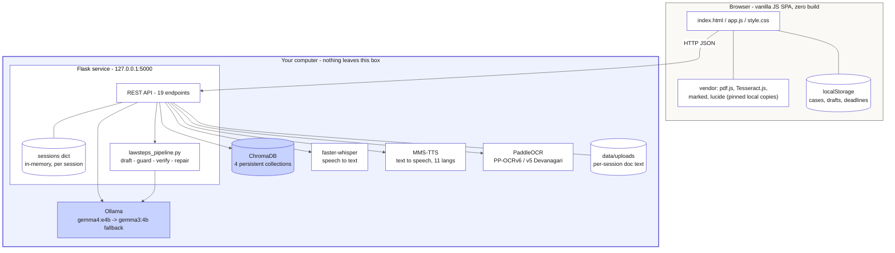
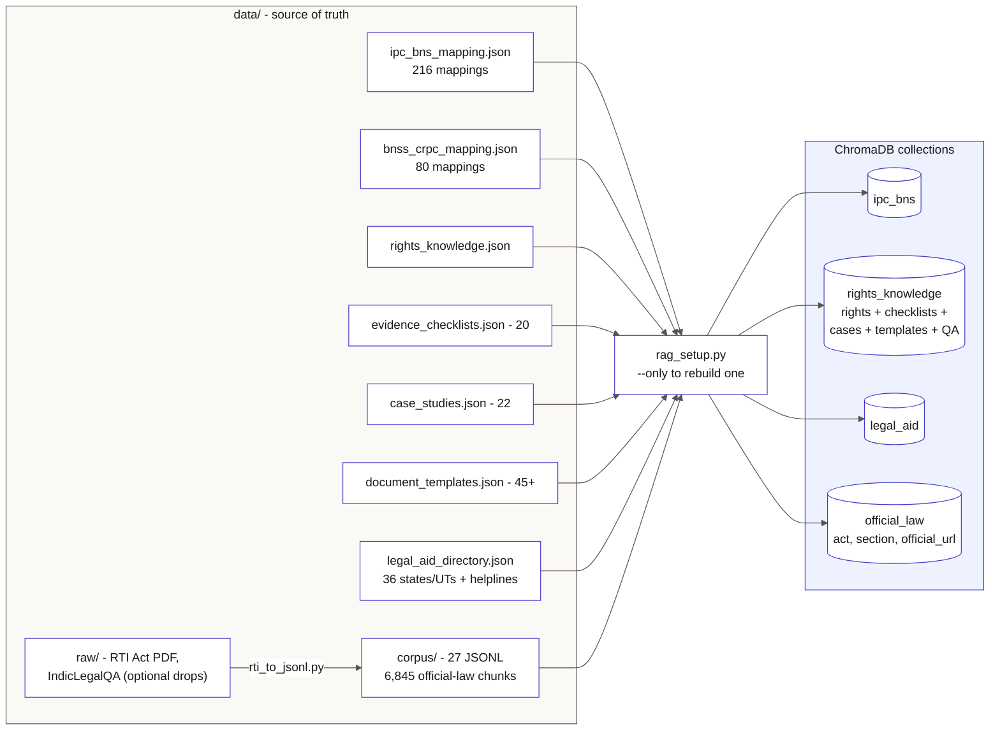
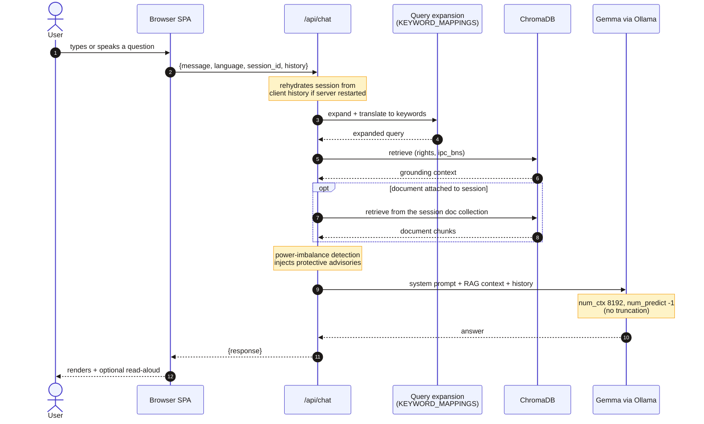
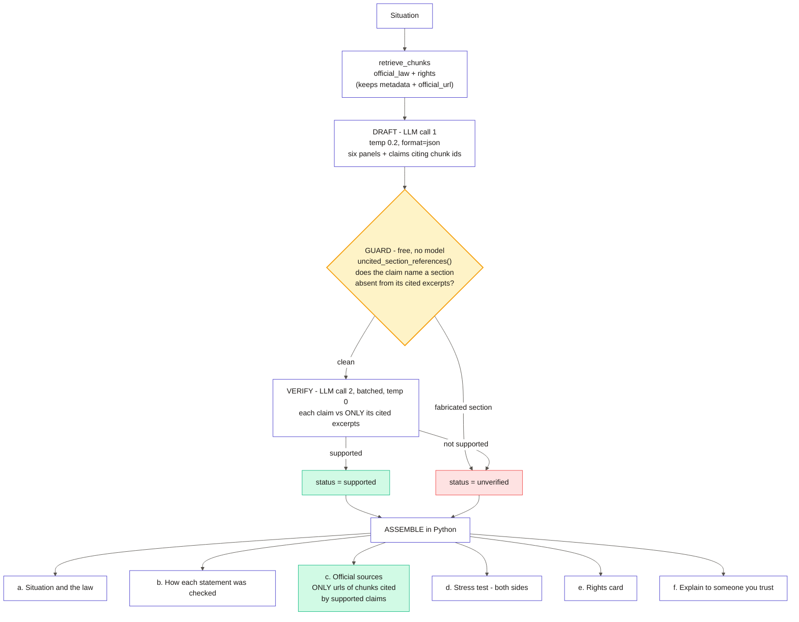
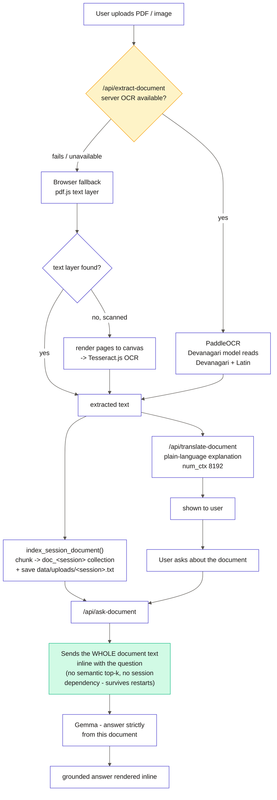
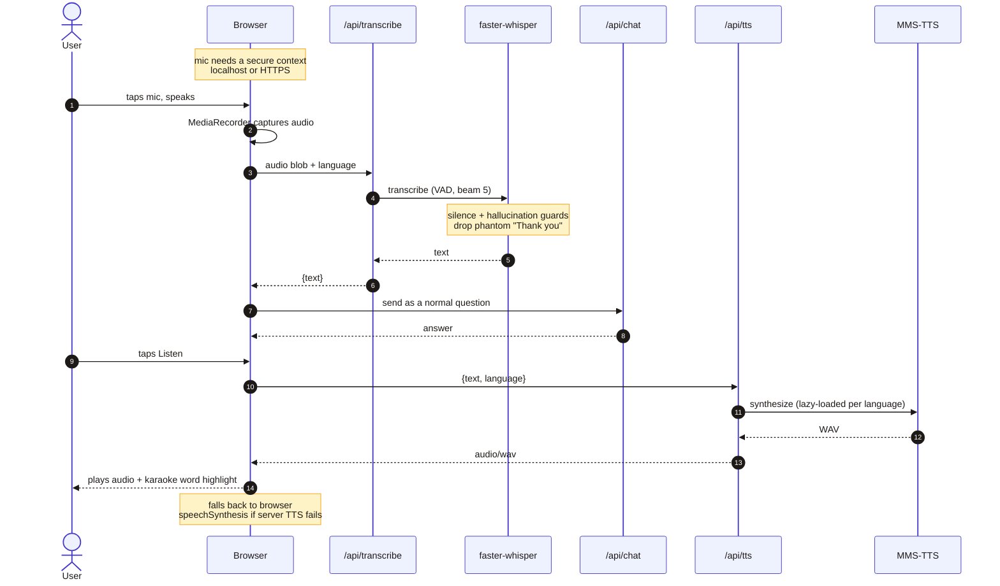
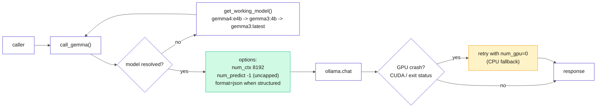
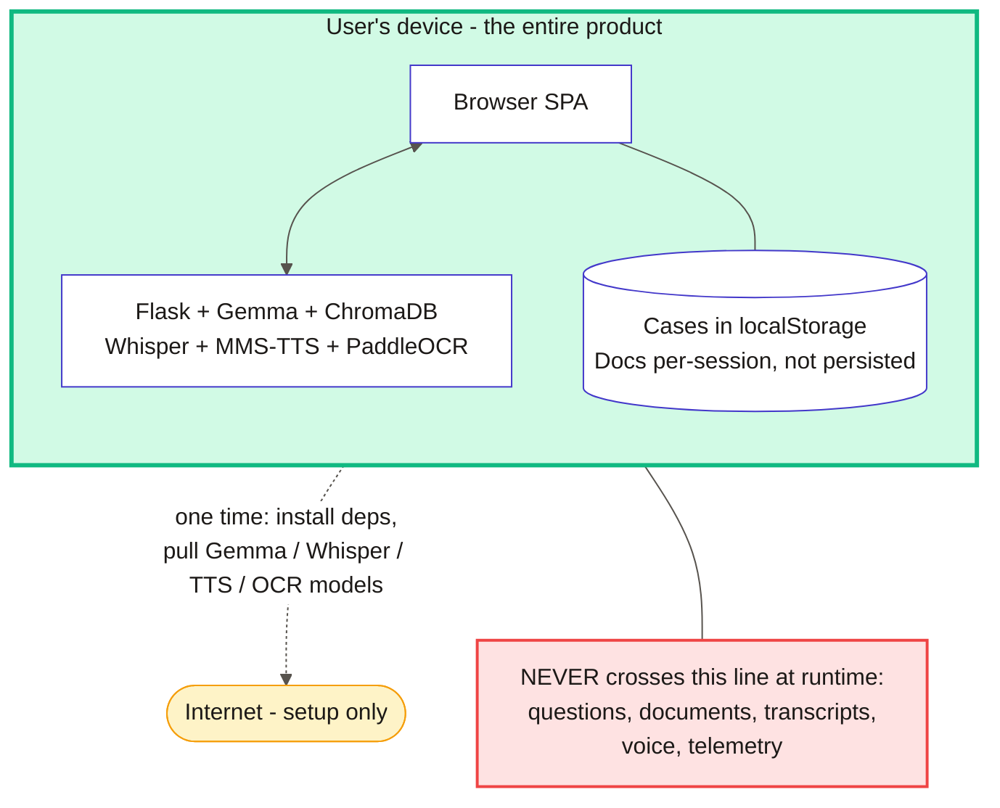

# अधिKaar - Architecture

Every diagram below reflects the actual code. Nothing in the runtime path leaves the user's machine.

Section 0 is the whole system in one view. Sections 1-8 are zoom-ins on each part of it.

---

## 0. Master Architecture - Everything In One View

```mermaid
%%{init: {'theme':'base','flowchart':{'htmlLabels':true,'wrappingWidth':260,'nodeSpacing':45,'rankSpacing':55,'useMaxWidth':true},'themeVariables':{'primaryColor':'#EEF2FF','primaryTextColor':'#1C1917','primaryBorderColor':'#4338CA','secondaryColor':'#FAF9F6','tertiaryColor':'#FFFFFF','lineColor':'#57534E','textColor':'#1C1917','mainBkg':'#FFFFFF','nodeBorder':'#4338CA','clusterBkg':'#FFFFFF','clusterBorder':'#4338CA','edgeLabelBackground':'#FFFFFF','fontSize':'14px'}}}%%
flowchart TB
    subgraph SYS[" "]
    direction TB

    U(("Citizen<br/>types or speaks<br/>11 languages"))

    subgraph BROWSER["BROWSER - vanilla JS SPA"]
        direction TB
        VIEWS["9 views:<br/>Chat, Law and Next Steps,<br/>Cases, Converter, Legal Aid,<br/>Translate, Draft, Voice"]
        JS["app.js<br/>i18n 11 langs<br/>karaoke read-aloud<br/>mic capture"]
        VEND["vendor - pinned local<br/>pdf.js, Tesseract.js<br/>marked, lucide, fonts"]
        LS[("localStorage<br/>cases, transcripts<br/>drafts, deadlines")]
        VIEWS --- JS
        JS --- VEND
        JS --- LS
    end

    subgraph HOST["YOUR COMPUTER - works Wi-Fi off"]
        direction TB

        subgraph API["Flask - 127.0.0.1:5000"]
            direction LR
            E1["/api/chat"]
            E2["/api/law-and-steps"]
            E3["document endpoints:<br/>extract, upload,<br/>ask, translate"]
            E4["/api/bns-convert<br/>/api/crpc-convert"]
            E5["/api/draft-document<br/>/api/document-templates"]
            E6["/api/legal-aid<br/>/api/evidence-checklists"]
            E7["rights-card, consequence,<br/>elder, devil-advocate"]
            E8["/api/transcribe<br/>/api/tts"]
        end

        SESS[("sessions - in memory<br/>history + doc<br/>rehydrated on restart")]
        UPL[("data/uploads<br/>session doc text")]

        subgraph LOGIC["Deterministic logic - no model"]
            direction LR
            EXP["preprocess_query_for_rag<br/>multilingual expansion<br/>Hinglish finds English law"]
            PI["detect_power_imbalance<br/>protective advisories"]
            MC["match_checklist<br/>none when ambiguous"]
            NORM["_norm_section<br/>318 matches 318(4)<br/>+ offence-name search"]
            SAN["_sanitize_sources<br/>URL survives only<br/>if retrieved"]
        end

        subgraph PIPE["Verified answer - 2 LLM calls"]
            direction TB
            DR["DRAFT - LLM 1<br/>six panels + claims<br/>citing chunk ids"]
            GD{"GUARD - free<br/>claim names a section<br/>absent from its sources?"}
            VF["VERIFY - LLM 2<br/>claim vs only<br/>its own excerpts"]
            RP["REPAIR<br/>drop unsupported from<br/>law, rights, sources"]
            DR --> GD
            GD -->|"fabricated"| RP
            GD -->|"clean"| VF
            VF -->|"verdict"| RP
        end

        PANELS["Six panels built in Python<br/>a. situation and law<br/>b. how each was checked<br/>c. sources - verified only<br/>d. stress test<br/>e. rights card<br/>f. explain simply"]

        CG["call_gemma()<br/>num_ctx 8192<br/>num_predict -1 - no cutoff<br/>GPU crash to CPU retry"]

        subgraph MODELS["Local models - offline"]
            direction LR
            OL["Ollama<br/>gemma4:e4b<br/>gemma3:4b fallback"]
            WH["faster-whisper<br/>VAD + silence gating"]
            TS["MMS-TTS<br/>11 languages<br/>browser fallback"]
            PD["PaddleOCR v6 / v5<br/>picked by doc script<br/>Devanagari + Latin"]
        end

        subgraph RAG["ChromaDB"]
            direction LR
            C1[("ipc_bns<br/>216")]
            C2[("rights_knowledge<br/>142")]
            C3[("legal_aid<br/>143")]
            C4[("official_law<br/>6,845 chunks<br/>+ official_url")]
            C5[("doc_session<br/>per upload")]
        end

        subgraph DATA["data - human curated"]
            direction LR
            D1["mappings 216 + 80<br/>20 checklists<br/>22 cases, 45 templates"]
            D2["legal_aid_directory<br/>28 states + 8 UTs<br/>NALSA 15100"]
            D3["corpus - 27 JSONL<br/>BNS, BNSS, BSA,<br/>Constitution, Consumer"]
        end

        RS["rag_setup.py<br/>--only rebuilds one"]
    end

    NET(["Internet<br/>ONE TIME SETUP ONLY<br/>pip install, ollama pull"])
    BLOCK["NEVER crosses at runtime:<br/>questions, documents,<br/>transcripts, voice"]
    end

    %% client to server
    U --> VIEWS
    JS -->|"HTTP, loopback"| API

    %% endpoint routing
    E1 --> EXP
    E1 --> PI
    E1 -.->|"doc attached"| C5
    E2 --> PIPE
    E3 --> PD
    E3 --> UPL
    E3 -->|"chunk + index"| C5
    E4 --> NORM
    E5 --> D1
    E6 --> MC
    E8 --> WH
    E8 --> TS
    API --- SESS

    %% grounding
    EXP -->|"retrieve"| RAG
    MC --> C2
    PIPE -->|"retrieve_chunks<br/>keeps URL"| C4
    PIPE --> SAN
    SAN --> PANELS
    RP --> PANELS

    %% model calls
    EXP --> CG
    PI --> CG
    E7 --> CG
    DR --> CG
    VF --> CG
    CG --> OL

    %% build path
    D1 --> RS
    D2 --> RS
    D3 --> RS
    RS --> C1
    RS --> C2
    RS --> C3
    RS --> C4

    %% answers back
    PANELS -->|"verified JSON"| JS
    CG -->|"answer"| JS
    TS -->|"WAV + karaoke"| JS
    WH -->|"text"| JS

    %% boundary
    HOST -. "one time only" .-> NET
    HOST --- BLOCK

    classDef safe fill:#D1FAE5,stroke:#10B981,stroke-width:2px,color:#1C1917
    classDef warn fill:#FEF3C7,stroke:#F59E0B,stroke-width:2px,color:#1C1917
    classDef danger fill:#FEE2E2,stroke:#EF4444,stroke-width:2px,color:#1C1917
    classDef store fill:#C7D2FE,stroke:#4338CA,color:#1C1917
    classDef default fill:#FFFFFF,stroke:#4338CA,color:#1C1917

    class GD warn
    class RP,PANELS,SAN safe
    class BLOCK danger
    class C1,C2,C3,C4,C5,LS,SESS,UPL store
    class NET warn
    style SYS fill:#F4F2ED,stroke:#D8D4CC,stroke-width:2px,color:#1C1917
    style HOST fill:#EEF2FF,stroke:#4338CA,stroke-width:3px,color:#1C1917
    style BROWSER fill:#FAF9F6,stroke:#57534E,stroke-width:2px,color:#1C1917
    style PIPE fill:#FFFFFF,stroke:#4338CA,stroke-width:2px,color:#1C1917
    style LOGIC fill:#FFFFFF,stroke:#10B981,color:#1C1917
    style API fill:#FFFFFF,stroke:#4338CA,color:#1C1917
    style MODELS fill:#FFFFFF,stroke:#4338CA,color:#1C1917
    style RAG fill:#FFFFFF,stroke:#4338CA,color:#1C1917
    style DATA fill:#FFFFFF,stroke:#57534E,color:#1C1917
```

### How to read it

- **Everything inside the big indigo box is one machine.** The only arrow leaving it is the dotted one-time setup fetch. That is the entire privacy story.
- **Green = deterministic.** No model can override it: the section-fabrication guard, the source sanitiser, the checklist matcher, the repair step. These run for free and they run first.
- **Amber = the decision point.** The GUARD is where a wrong legal citation dies, before the model is ever asked to grade its own work.
- **Blue cylinders = stored state.** Note that the only durable user data (`localStorage`) sits in the browser, and the server's session memory is in-RAM and disposable.
- **Two LLM calls** for a verified answer. Everything else in the grounding path costs nothing.

---

## 1. System Overview

The whole product is one local process plus a browser. There is no server, no account, no outbound call at runtime.

---

## 2. Knowledge Base and Retrieval Layer

`rag_setup.py` builds four ChromaDB collections from curated JSON plus the official-law corpus. Each corpus chunk keeps its act, section and official source URL, which is what lets citations resolve to real government pages.

---

## 3. Chat Request Flow

The multilingual expansion is why a Hinglish phrase like "mera malik ne salary nahi di" still reaches English-indexed unpaid-wages knowledge.

---

## 4. Verified "Law and Next Steps" Pipeline

The core anti-hallucination design. A claim naming a section that its own cited sources do not contain is rejected deterministically, before any model is trusted to grade itself.

Typical cost: 2 LLM calls (draft + verify). The guard is free and runs first, so the cheapest check kills the most dangerous error.

---

## 5. Document Flow - Upload, Explain, Ask

OCR picks its model from the document's script, not the UI language, because Indian legal papers are routinely Hindi plus English on one page.

---

## 6. Voice Flow

---

## 7. Model Call Path and Safety Rails

Notes that matter:
- `OLLAMA_HOST` is normalised to loopback before importing ollama - a host bound to `0.0.0.0` is not a valid connect target and silently broke every model call.
- `num_predict = -1` because a fixed cap was chopping detailed answers mid-sentence while the prompt was asking for detail.

---

## 8. Privacy Boundary

---

## Request Map

| Surface | Endpoint | Grounding |
|---|---|---|
| Talk to Legal Helper | `/api/chat` | rights + ipc_bns + attached doc |
| Law and Next Steps | `/api/law-and-steps` | official_law + rights, verified pipeline |
| Ask about a document | `/api/ask-document` | whole document text sent inline |
| Document upload | `/api/extract-document`, `/api/upload-document`, `/api/clear-document` | PaddleOCR / pdf.js + Tesseract |
| Explain a document | `/api/translate-document` | ipc_bns section lookup |
| Section converters | `/api/bns-convert`, `/api/crpc-convert` | curated mappings, deterministic |
| Draft a document | `/api/draft-document`, `/api/document-templates` | 45+ templates |
| Legal aid | `/api/legal-aid` | legal_aid directory |
| Checklists | `/api/evidence-checklists`, `/api/rights-checklist` | 20 reviewed templates |
| Extras | `/api/rights-card`, `/api/consequence-simulator`, `/api/panchayat-bridge`, `/api/devil-advocate` | rights + situation |
| Voice | `/api/transcribe`, `/api/tts` | faster-whisper, MMS-TTS |
