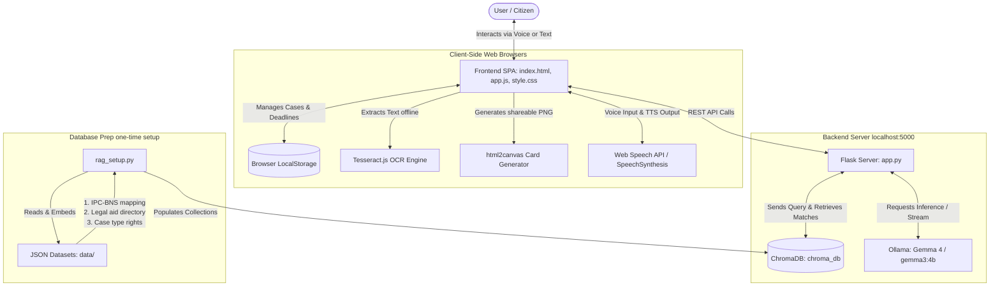

# अधिKaar (AdhiKaar) AI Legal Assistant - Technical Walkthrough & Architecture Guide

Welcome to the technical walkthrough of **अधिKaar (AdhiKaar)**. This guide provides a comprehensive overview of how the application is structured, how the data flows between the user, the frontend, the Flask backend, ChromaDB RAG, and the local Ollama LLM, and the specific roles of all code and data files.

---

## 1. Core Architecture Diagram

The diagram below illustrates the communication flow within **AdhiKaar**:

---

## 2. Role of Files & Folders

Here is the directory structure and the exact role of every file in the project:

| File / Folder Path | Type | Role & Description |
|:---|:---|:---|
| **`app.py`** | Python Script | The **Flask backend server**. It defines all REST API endpoints, handles session management, manages RAG retrievals from ChromaDB, constructs complex system prompts, handles fallback logic for Ollama model hardware compatibility, and spins up the server on port `5000`. |
| **`rag_setup.py`** | Python Script | The **data ingestion pipeline**. It initializes ChromaDB, creates the collections (`ipc_bns`, `rights_knowledge`, `legal_aid`), embeds the dataset texts using the `all-MiniLM-L6-v2` function, and saves them to the persistent database. |
| **`requirements.txt`** | Configuration | List of Python dependencies: `flask`, `flask-cors`, `ollama`, `chromadb`. |
| **`data/`** | Directory | Contains the raw JSON datasets that populate the ChromaDB RAG system. |
| ├─ **`ipc_bns_mapping.json`** | JSON Data | A dataset containing 75+ mapping rules matching old Indian Penal Code (IPC) sections with new Bharatiya Nyaya Sanhita (BNS) sections, including offense descriptions, key changes, and punishments. |
| ├─ **`legal_aid_directory.json`** | JSON Data | Contains contact directories for State Legal Services Authorities (SLSA), District Legal Services Authorities (DLSA) for multiple states/districts, and national legal helpline numbers. |
| └─ **`rights_knowledge.json`** | JSON Data | Structured legal knowledge categorizing common case types (unpaid salary, tenant deposits, domestic violence, online fraud), key legal rights, actionable steps, documentation checklists, and a glossary of legal terms. |
| **`chroma_db/`** | Directory | The persistent vector database folder created by ChromaDB. |
| **`static/`** | Directory | Contains the assets serving the frontend Single Page Application (SPA). |
| ├─ **`index.html`** | HTML5 | The main interface layout. It is structured into multiple views (home, chat, bns, legal-aid, document translation, case dashboard, drafting form, virtual courtroom), contains modal templates for the rights card, and includes scripts for Lucide icons, Marked.js, Tesseract.js, and html2canvas. |
| ├─ **`app.js`** | JavaScript | The core **frontend client application logic**. It controls navigation between views, handles the multiligual translation system (i18n), manages voice-first speech synthesis and recognition, runs client-side OCR, interfaces with browser `localStorage` for case management, and performs API calls to the Flask backend. |
| └─ **`style.css`** | CSS3 | The styling layer. Designed specifically for accessibility (18px+ font options, large touch targets, responsive layouts) and supports a light default theme and dark theme option. |

---

## 3. How the Website Works: Feature Walkthrough

The website functions as a **Single Page Application (SPA)** that swaps views dynamically by updating class states and using CSS transition effects. No frontend compilation is required, allowing the app to run completely client-side.

### A. Home Dashboard & Quick-Ask
*   **Hero Section**: Introduces the user to the tool. Displays animatible statistics (BNS mappings, languages, privacy guarantees) when scrolled into view.
*   **Doorway Input**: The user can type or record a voice input from the main page, which instantly transfers them into the **Legal Helper Chat** and begins the conversation.

### B. Legal Helper Chat (Main AI Engine)
*   **RAG Context Augmentation**: When the user describes their issue (e.g., *"My landlord is refusing to return my security deposit"*), the backend queries the `rights_knowledge` and `ipc_bns` collections in ChromaDB to retrieve relevant legal articles, sections, and steps.
*   **Confirmation Loop**: To prevent hallucination and align the AI, the assistant **first** restates the user's situation in plain language and asks: *"Is this correct?"* The AI will not give advice until the user confirms.
*   **Power-Imbalance Detection**: The system analyzes keywords to identify imbalances (e.g., Employer vs Worker, Landlord vs Tenant, Police vs Citizen). If a match is found, the AI automatically displays a custom ** PROTECTIVE ADVISORY** instructing the citizen on critical safety rules (e.g., *"Do not sign documents on the spot," "Do not surrender original paperwork"*).
*   **Actionable Chat Modules**:
    *   **What If I Do Nothing? (Consequence Simulator)**: Models a realistic legal timeline showing the progression of inaction (0-7 days, 1-4 weeks, 1-6 months, 6+ months), the worst-case scenario, and the single most urgent action.
    *   **Explain to Elder (Panchayat Bridge)**: Rewrites complex legal counsel into an simplified, highly respectful community format suitable for village leaders, elders, or ASHA/NGO workers.
    *   **Checklist**: Generates a case-specific checklist categorized by documents to collect, evidence to preserve, offices to visit, and deadlines.
    *   **Rights Card**: Generates a digital card showing the user's rights. The card can be rendered into an image and downloaded using the client-side `html2canvas` library.

### C. IPC ↔ BNS Section Converter
*   On July 1, 2024, India replaced the British-era Indian Penal Code (IPC) with the Bharatiya Nyaya Sanhita (BNS).
*   Users can type a section number (e.g., *420*) or keyword (e.g., *theft*).
*   The system searches the local JSON dataset for exact matches, queries ChromaDB for semantic matches, and runs a specialized LLM call to explain what key modifications occurred under the new law.

### D. Find Legal Aid Near You
*   A localized state-and-district drilldown.
*   The user selects their state (e.g., *Delhi*) and district (e.g., *New Delhi*).
*   The system queries the backend to fetch contact details for the **State Legal Services Authority (SLSA)** and the nearest **District Legal Services Authority (DLSA)**, providing the citizen with phone numbers, websites, and physical addresses to obtain free legal representation.

### E. Translate & Explain Legal Documents
*   Designed to help users understand complex court summons, FIRs, or legal notices.
*   Users can upload a photo of the document. The frontend runs **Tesseract.js** client-side to extract text offline (ensuring document text never leaves the user's computer).
*   The text is then sent to the backend `/api/translate-document` endpoint, which translates legal vocabulary into plain everyday language, highlighting critical deadlines, key parties involved, cited laws, and what the reader needs to do next.

### F. Case Workspace ("My Cases")
*   Rather than starting a new conversation each time, users can organize their legal situations into individual workspaces.
*   All conversations, drafted documents, and deadlines are saved privately on the user's device via browser `localStorage`.
*   Users can set custom alert deadlines (e.g., *"Reply to notice by August 15"*) which display visual warning states on the dashboard if they are within 7 days.

### G. Document Drafting Engine
*   Drafts standard templates under Indian law:
    *   **Legal Notice**: Demand notices for unpaid salary, deposit recoveries, or breach of contract.
    *   **Consumer Complaint**: Addressed to the District Consumer Commission.
    *   **RTI Application**: Right to Information applications.
    *   **Police Complaint**: Written complaints to register an FIR.
*   The generator pulls context from the active chat history to pre-fill the facts, maps BNS sections, and generates a printable document that can be downloaded as a `.doc` file or printed directly.

### H. Virtual Courtroom
*   To prepare citizens for hearings, the system simulates a moot court session.
*   It operates in 3 sequential rounds:
    1.  **Round 1**: Opening arguments from both sides; the Judge frames the key legal issues.
    2.  **Round 2**: Rebuttals with citations of BNS laws and precedents. The Judge questions the weaker claims.
    3.  **Round 3**: Closing arguments followed by the Judge's realistic assessment, case strength rating (out of 10), and suggestions on what evidence to collect.

### I. Kiosk / Voice-First Mode
*   A fullscreen accessibility overlay designed for rural communities.
*   Features a simple interface with a large central microphone button.
*   Uses the browser's native **Web Speech API** for voice recognition in local languages, queries the AI, and outputs the reply aloud using TTS synthesis.

---

## 4. REST API Endpoint Reference

The Flask server (`app.py`) listens on port `5000` and exposes the following endpoints:

| Endpoint | Method | Payload (JSON) | Output (JSON) | Description |
|:---|:---|:---|:---|:---|
| `/api/languages` | `GET` | *None* | `{ "languages": [...] }` | Returns list of supported languages (codes, names, native script, speech codes). |
| `/api/chat` | `POST` | `{ "message": "...", "language": "...", "session_id": "..." }` | `{ "response": "...", "session_id": "...", "power_imbalance": { "detected": true/false, "details": [...] } }` | Core chat endpoint. Performs ChromaDB RAG, detects power imbalance, constructs main system prompt, and calls Ollama. |
| `/api/devil-advocate` | `POST` | `{ "situation": "...", "language": "...", "session_id": "..." }` | `{ "response": "..." }` | Devil's advocate advisor mode. Arguments are generated against the user's position to stress-test their claims. |
| `/api/bns-convert` | `POST` | `{ "query": "...", "direction": "ipc_to_bns"/"bns_to_ipc" }` | `{ "results": [...], "ai_explanation": "..." }` | Searches the static mapping data and RAG vector store for criminal code equivalents, returning an AI explanation of the amendments. |
| `/api/legal-aid` | `GET` | Params: `state` (optional), `district` (optional) | `{ "helplines": [...], "states": [...], "districts": [...] }` | Returns details of state and district legal services authorities. |
| `/api/translate-document` | `POST` | `{ "text": "...", "language": "..." }` | `{ "response": "..." }` | Explains OCR text in plain language, extracting parties, deadlines, and actions. |
| `/api/panchayat-bridge` | `POST` | `{ "situation": "...", "advice": "...", "language": "..." }` | `{ "response": "..." }` | Translates legal advice into simple, respectful guidelines for community intermediaries. |
| `/api/rights-checklist` | `POST` | `{ "situation": "...", "language": "..." }` | `{ "response": "..." }` | Generates a situation-specific actionable legal checklist. |
| `/api/consequence-simulator` | `POST` | `{ "situation": "...", "language": "..." }` | `{ "response": "..." }` | Simulates a timeline of legal risks if no action is taken. |
| `/api/rights-card` | `POST` | `{ "situation": "...", "advice": "...", "language": "..." }` | `{ "card": { "title": "...", "situation_summary": "...", "rights": [...], "key_sections": [...], "urgent_action": "...", "helplines": [...] } }` | Generates structured JSON summarizing legal rights for card generation. |
| `/api/draft-document` | `POST` | `{ "doc_type": "...", "fields": {...}, "situation": "...", "language": "..." }` | `{ "response": "..." }` | Returns formatted drafted document along with submission guidance. |
| `/api/courtroom` | `POST` | `{ "situation": "...", "round": 1/2/3, "history": "...", "language": "..." }` | `{ "round": 1/2/3, "roles": { "your_lawyer": "...", "opposing_lawyer": "...", "judge": "..." }, "raw": "..." }` | Runs moot court round calculations. |

---

## 5. Setup & Execution Lifecycle

When running **AdhiKaar** locally, the application executes through the following steps:

1.  **Ingestion Lifecycle (`python rag_setup.py`)**:
    *   Reads the three JSON documents in the `data/` directory.
    *   Connects to ChromaDB via `chromadb.PersistentClient`.
    *   Iterates through items, compiles rich text summaries, calls the default `all-MiniLM-L6-v2` embedding engine, and inserts the vectors into ChromaDB collections.
2.  **Server Initialisation (`python app.py`)**:
    *   Flask loads datasets (`IPC_BNS_DATA`, `LEGAL_AID_DATA`, `RIGHTS_DATA`) into server memory for O(1) keyword queries.
    *   Connects to ChromaDB.
    *   **Lazy Model Resolution**: On the very first model request, `get_working_model()` tests `gemma4:e4b`, falling back to `gemma3:4b` or `gemma3:latest` if hardware constraints occur.
3.  **Client-Server Loop**:
    *   `index.html` renders.
    *   `app.js` runs state machine initialization, sets up local storage caches, and sets event listeners.
    *   API requests are dispatched via standard `fetch` queries, prompting local inference via Ollama and RAG queries via ChromaDB.
